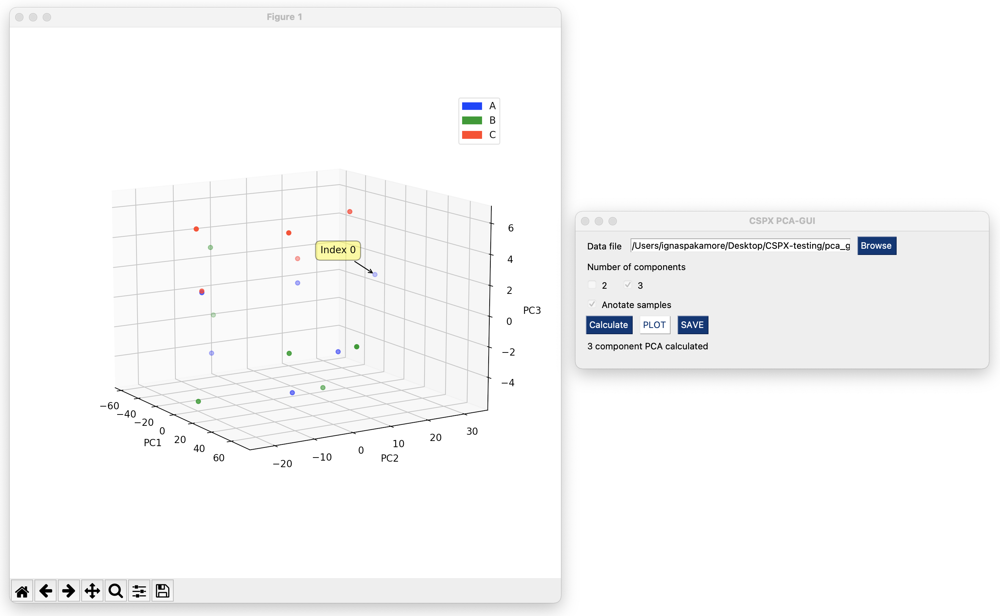

# PCA-GUI

## General features 

This program is designed to calculate and visualise principle component analysis calculations. 

* The input is excel spredsheet saved in xlsx or csv format. 

* Headers for the columns is not required. 

* To specifie the type add column 'Type' and for colour column named 'Colour'.

* The colour name must be string. See https://matplotlib.org/stable/gallery/color/named_colors.html for colour names. 

* Program can save calculated PCA data into the csv file. 

* Sample annotation by using mouse is feasible in 3D plot. For 2D data index is displayed on the plot. Index starts from 0!

## Execution

Create a bash script where path to PCA-gui.py is specified and executed by python3. Then convert it to executable.  

```
export main=path/to/pca-gui/PCA-gui.py

python3 $main 
```
Fisr of all, data file must be selected. Then the number of PCA components must be specified and calculation performed by hitting 'Caculate' button. The plot will be generated based on the number of components selected. Annotation must be specified before calculation. 



